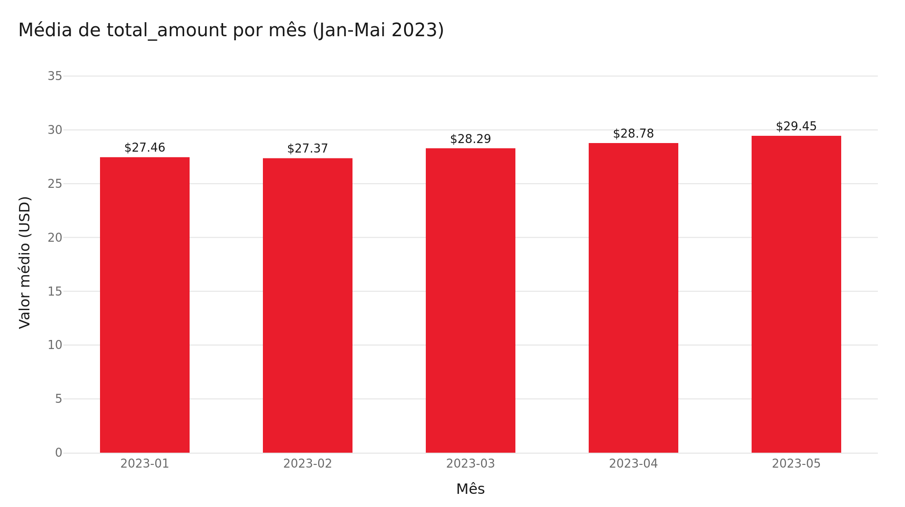
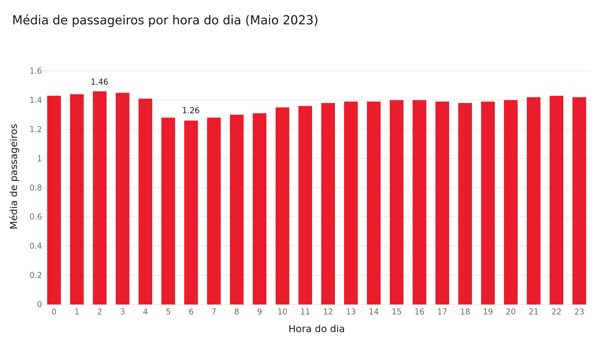
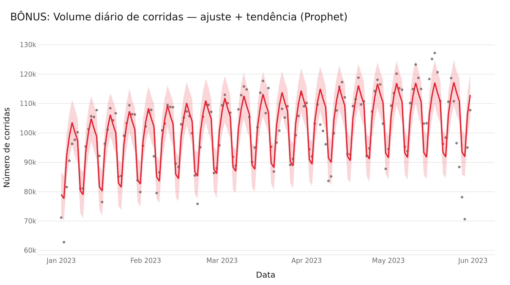
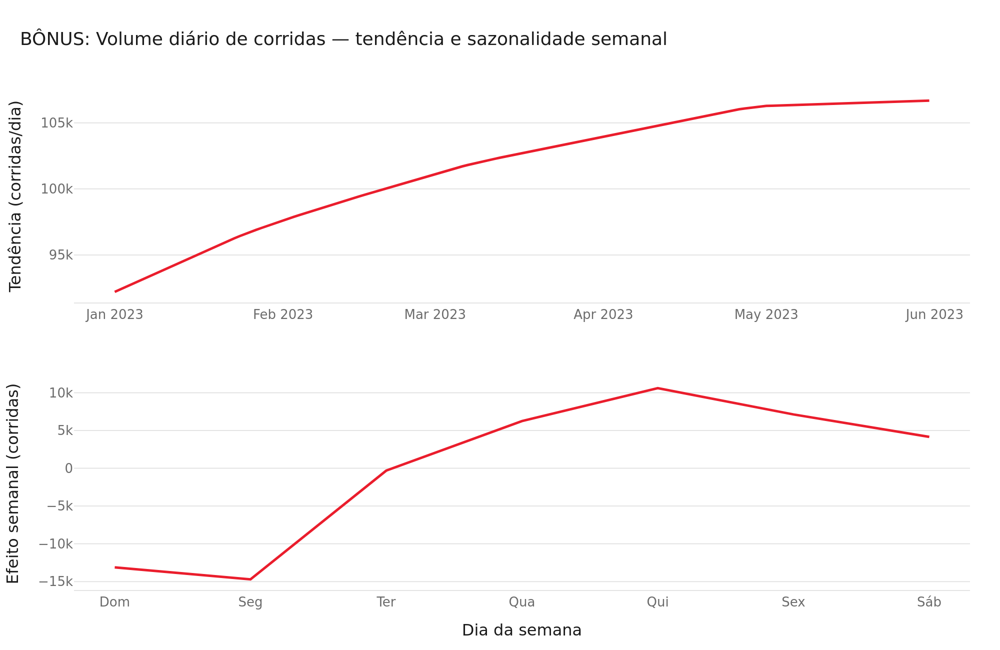

# Análises Analíticas — Respostas

Respostas às duas perguntas analíticas do case, computadas diretamente
sobre `ifood_case.silver.yellow_taxi_trips` (features 004-006), sem
filtragem ou limpeza adicional própria desta feature. Ver também
`avg_total_amount_by_month.sql` e `avg_passenger_count_by_hour_may.sql`
para as queries standalone, executáveis diretamente por qualquer pessoa
com acesso ao SQL Warehouse.

---

## Pergunta 1 — Qual a média de valor total (`total_amount`) recebido
em um mês, considerando todos os yellow táxis da frota?

**Query**: [`avg_total_amount_by_month.sql`](./avg_total_amount_by_month.sql)

**Computado em**: 2026-07-23T20:16:33Z

| Mês | Média `total_amount` | Nº de corridas |
|---|---|---|
| 2023-01 | 27.46 | 2,918,145 |
| 2023-02 | 27.37 | 2,764,536 |
| 2023-03 | 28.29 | 3,227,403 |
| 2023-04 | 28.78 | 3,110,368 |
| 2023-05 | 29.45 | 3,318,965 |

**Resposta em linguagem simples**: a média de `total_amount` subiu de
~$27.46 em janeiro para ~$29.45 em maio — uma tendência de alta ao
longo dos 5 meses do case, com uma pequena queda em fevereiro.

---

## Pergunta 2 — Qual a média de passageiros (`passenger_count`) por
cada hora do dia, considerando as corridas de maio e todos os yellow
táxis da frota?

**Query**: [`avg_passenger_count_by_hour_may.sql`](./avg_passenger_count_by_hour_may.sql)

**Computado em**: 2026-07-23T20:16:33Z

| Hora | Média `passenger_count` | Nº de corridas |
|---|---|---|
| 0 | 1.43 | 88,573 |
| 1 | 1.44 | 57,516 |
| 2 | 1.46 | 37,012 |
| 3 | 1.45 | 24,078 |
| 4 | 1.41 | 15,727 |
| 5 | 1.28 | 18,188 |
| 6 | 1.26 | 45,434 |
| 7 | 1.28 | 91,705 |
| 8 | 1.30 | 125,379 |
| 9 | 1.31 | 140,801 |
| 10 | 1.35 | 153,493 |
| 11 | 1.36 | 167,237 |
| 12 | 1.38 | 180,342 |
| 13 | 1.39 | 184,478 |
| 14 | 1.39 | 200,592 |
| 15 | 1.40 | 204,899 |
| 16 | 1.40 | 205,022 |
| 17 | 1.39 | 223,990 |
| 18 | 1.38 | 238,012 |
| 19 | 1.39 | 213,712 |
| 20 | 1.40 | 189,936 |
| 21 | 1.42 | 194,142 |
| 22 | 1.43 | 179,488 |
| 23 | 1.42 | 139,209 |

**Resposta em linguagem simples**: a média de passageiros por corrida é
mais baixa durante o início da manhã (hora 6, ~1.26), sobe suavemente ao
longo do dia, e é mais alta de madrugada (hora 2, ~1.46) — variação
pequena (entre 1.26 e 1.46), sem grandes picos de corridas com múltiplos
passageiros em nenhuma hora específica.

---

## Bonus: Volume Diário de Corridas — Tendência e Sazonalidade (Prophet)

> ⚠️ **Conteúdo diferencial/bonus** — não é uma das duas perguntas
> obrigatórias do case (Perguntas 1 e 2 acima). Não deve ser interpretado
> como substituto de nenhuma das respostas obrigatórias.

**Query**: [`daily_trip_counts.sql`](./daily_trip_counts.sql) — contagem
de corridas por dia calendário, toda a frota, Jan 1-Mai 31 2023 (151
dias, sem lacunas).

**Computado em**: 2026-07-23T21:41Z

Modelo: `Prophet(yearly_seasonality=False, weekly_seasonality=True,
daily_seasonality=False)`, ajustado sobre a série diária e avaliado
(`.predict()`) apenas sobre as mesmas datas históricas — sem previsão
para datas futuras (não era o objetivo: o pedido foi ver o padrão já
existente nos dados).

### Ajuste + tendência

### Componentes: tendência e sazonalidade semanal

**Interpretação**: o volume diário de corridas mostra uma **tendência
de alta** ao longo de Jan-Mai 2023 — a curva de tendência do Prophet sai
de ~92 mil corridas/dia no início de janeiro para ~107 mil corridas/dia
no final de maio. Sobreposto a essa tendência, há um **padrão semanal
repetido e claro**: domingo e segunda-feira são consistentemente os dias
de menor volume (cerca de -13 a -15 mil corridas abaixo da tendência),
subindo ao longo da semana até um pico na quinta-feira (~+10.6 mil acima
da tendência), com sexta e sábado em nível intermediário — o padrão
típico de menor uso de táxi no início da semana/fim de semana e maior
uso nos dias úteis centrais.

